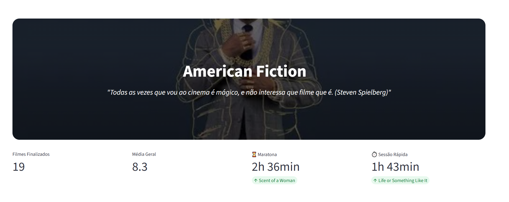
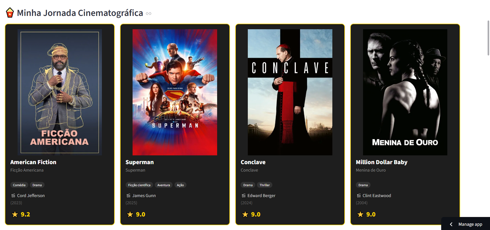

# 🎬 Movies Wrapped 2025

[ English](#english) | [ Português](#português)

## 🖼️ Preview

### Dashboard Overview

### Movie Journey

---

##  English

**Movies Wrapped** is a data visualization project designed to analyze a personal movie journey. The core objective was to build a robust pipeline that transforms a simple CSV file into an enriched, interactive dashboard.

🔗 **Live App:** [movieswrapped.streamlit.app](https://movieswrapped.streamlit.app)

### 🛠️ Technical Stack & Architecture

- **Python & POO:** Organized into modular classes (`TMDBClient`, `MovieProcessor`) to ensure clean code and easy maintenance.
- **Pandas:** Used for complex data cleaning, handling null values, and creating separate dataframes for display and metrics calculation.
- **Streamlit:** Selected for the frontend to create a responsive, high-performance dashboard with custom CSS injection.
- **REST API Integration:** Consumes the TMDB API via the `requests` library to fetch posters, backdrops, directors, and runtimes.

### ⚙️ Engineering Highlights

- **Data Enrichment Pipeline:** A dedicated script (`enrich.py`) automates the process of fetching metadata for each movie in the input file.
- **Logical Data Separation:** Implemented a "Sentinel Value" logic (rating `-1`) to categorize dropped movies, allowing specific UI behaviors (opacity/filtering) without compromising the statistical dataset.
- **Performance Optimization:** Leveraged `@st.cache_data` to ensure near-instant page reloads and filter applications.

### ⚙️ Setup & Installation
1. **Clone the repo:** `git clone https://github.com/eliasmaia/movies-wrapped.git`
2. **Install dependencies:** `pip install -r requirements.txt`
3. **Environment Variables:** Create a `.env` file and add your `TMDB_TOKEN`.
4. **Run the pipeline:** `python enrich.py`
5. **Launch the dashboard:** `streamlit run dashboard.py`

---

##  Português

O **Movies Wrapped** é um projeto de visualização de dados focado na análise de uma jornada cinematográfica pessoal. O objetivo central foi construir um pipeline robusto que transforma um arquivo CSV simples em um dashboard rico e interativo.

### 🛠️ Stack Técnica & Arquitetura

- **Python & POO:** Organizado em classes modulares (`TMDBClient`, `MovieProcessor`) para garantir um código limpo e de fácil manutenção.
- **Pandas:** Utilizado para limpeza de dados, tratamento de valores nulos e criação de dataframes distintos para exibição e cálculo de métricas.
- **Streamlit:** Escolhido para o frontend para criar um dashboard responsivo e de alta performance com injeção de CSS customizado.
- **Integração de API REST:** Consome a API do TMDB via biblioteca `requests` para buscar posters, backdrops, diretores e tempos de duração.

### ⚙️ Destaques de Engenharia

- **Pipeline de Enriquecimento:** Um script dedicado (`enrich.py`) automatiza o processo de busca de metadados para cada filme no arquivo de entrada.
- **Separação Lógica de Dados:** Implementação de lógica de "Valor Sentinela" (nota `-1`) para categorizar filmes abandonados, permitindo comportamentos específicos na UI (opacidade/filtros) sem comprometer o dataset estatístico.
- **Otimização de Performance:** Uso de `@st.cache_data` para garantir que o recarregamento da página e a aplicação de filtros sejam instantâneos.

### ⚙️ Instalação e Configuração
1. **Clone o repositório:** `git clone https://github.com/eliasmaia/movies-wrapped.git`
2. **Instale as dependências:** `pip install -r requirements.txt`
3. **Variáveis de Ambiente:** Crie um arquivo `.env` e adicione seu `TMDB_TOKEN`.
4. **Execute o enriquecimento:** `python enrich.py`
5. **Inicie o dashboard:** `streamlit run dashboard.py`

---
Developed by [Elias Maia](https://github.com/eliasmaia) 🎬